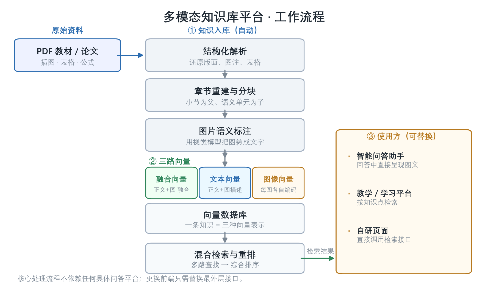
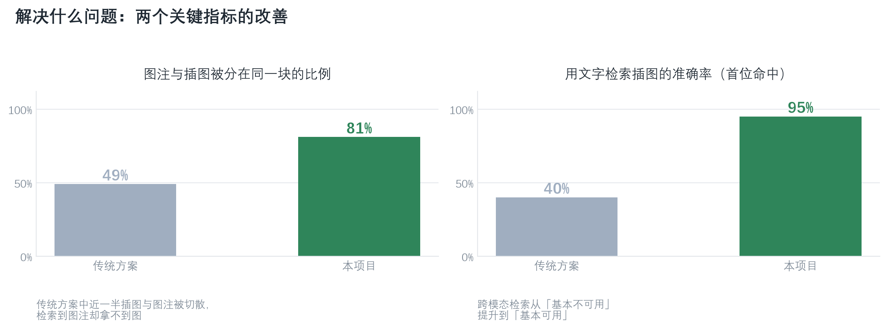
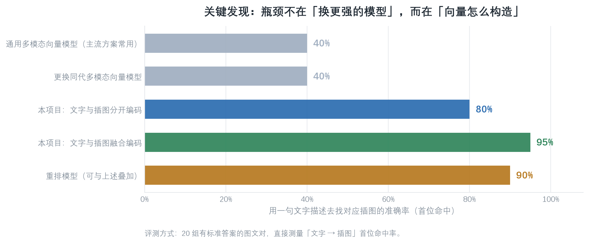
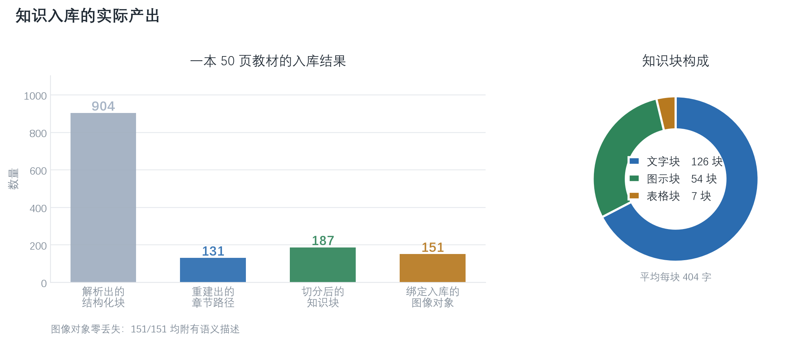
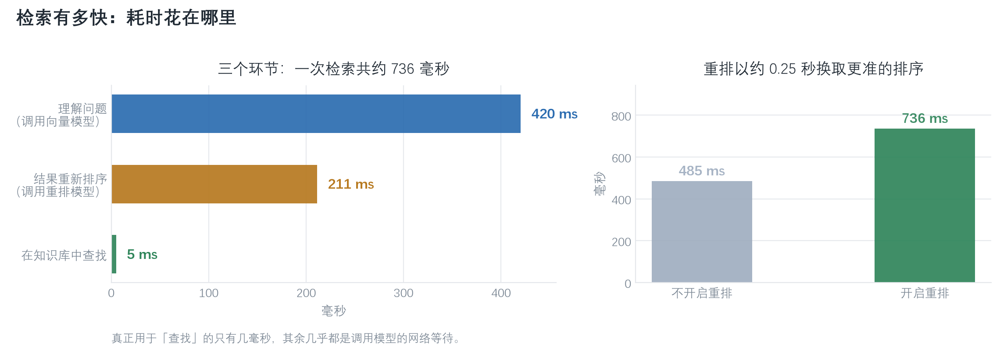

# 科研训练结题报告

**项目名称：电子工程训练智能助手**
**——面向垂直专业教育的可迁移多模态知识库构建工具**

| 项目信息 | |
| --- | --- |
| 资助级别 | 校级 |
| 主持人 | 廖琪　学号：923108320216　专业：武器发射工程 |
| 组员 | 黄子昂　学号：924106840121　专业：智能科学与技术 |
| 组员 | 魏子哲　学号：924108320226　专业：武器发射工程 |
| 指导老师 | 王建花 |
| 结题时间 | 2026 年 9 月 30 日 |
| 学院 | 电子工程与光电技术学院 |

> 文中图表由项目脚本自动生成，数据更新后可一键重新出图。

---

## 目录

- 摘要
- 1 项目简介
- 2 总体方案
- 3 关键技术
- 4 项目成果
- 5 项目特色与创新点
- 6 局限性与后期展望
- 7 体会与反思
- 8 致谢
- 9 参考文献
- 10 附录

---

## 摘要

在电子工程训练等**专业性较强的学科**中，教材与手册的知识大量承载于**插图、电路图、表格与公式**之中。学生真正要解决的问题往往是"这张接线图怎么读""通电前要检查哪几项"——答案天然绑定在图上。然而，当前主流的检索增强生成（RAG）技术把文档当作**纯文本**处理，在这类"富文本"资料上存在三个硬伤：**切分把知识切碎**（图与图注被分到不同片段）、**跨模态检索基本无效**（用文字找图的准确率仅约 40%）、**图文无法在回答中可靠呈现**。

本项目的主目标是构建一套**可迁移、可复用的富文本教材与论文向量化工具**，把垂直专业领域的 PDF 资料加工成"可文搜图、可图搜图"的结构化知识库。

之所以把重点放在工具而非"智能助手"上：问答助手类应用与框架已相当成熟，重复实现难以体现研究价值；而富文本知识的组织与跨模态检索，恰恰是现有框架没有解决、也解决不了的环节。因此本项目把"智能助手"作为验证知识库效果的演示形态，把工具本身作为核心成果。

项目的主要工作与结论：

1. **自建了一套完整、自动化的知识入库流程**：从解析、章节重建、分块、图片语义标注到向量化入库，一条命令完成，重复入库不会产生重复数据。
2. **提出并验证了"三路向量并存"的知识表示方式**——同一条知识同时用三种向量表示，其中"文字与插图融合编码"的一路使跨模态检索准确率由 **40% 提升至 95%**。
3. **用"把图变成文字"作为兜底路径**，使图片内容可被检索不再完全依赖跨模态模型的能力。
4. **图片与表格由程序确定性地送入回答**，不依赖大模型复述，从根本上解决"资料里有图、回答里没有图"的问题。

实测：一本 50 页教材数分钟内完成入库（187 条知识、151 个图像对象、131 条章节路径），检索响应约 0.7 秒，内置题集召回 10/10。在**同一份教材、同一个大模型、同一套提示词**下，仅更换知识库，原本无法回答的四类图文问题全部得到完整解答。

**关键词：** 多模态检索；检索增强生成；富文本教材；向量化工具；垂直领域教育

---

## 1 项目简介

### 1.1 项目背景

**电子工程训练类课程的知识形态，与通用文本问答差异很大。** 这类教材的核心信息高度依赖图形化表达：元器件外形与封装、电路原理图、接线与装配示意图、仪器面板、工艺流程图、参数表格与特性曲线。它们有两个共同特点：**一是图文强耦合**——图注、符号、参数与正文互为解释；**二是高度专业**——术语密集、相似图形多，靠通用语义模型很难区分。

通用 RAG 技术在这类资料上有三个层次的失效：

| 问题 | 具体表现 | 实测依据 |
| --- | --- | --- |
| **切分把知识切碎** | 图与图注被分到不同片段，检索命中图注却拿不到图 | 通用方案中图注与图同块率仅 **49%** |
| **跨模态检索基本无效** | 用文字搜图、用图搜图都不可用 | 主流多模态向量模型"文字→插图"首位命中率仅 **40%** |
| **图文无法可靠呈现** | 即使检索到图文内容，回答里仍可能只有文字 | 传统链路指望大模型复述图片信息，模型可能改写或遗漏 |

这些失效对教学场景是致命的：学生问"接地保护示意图说明了什么"，答案完全在图里，而传统链路既检索不到、也呈现不出。

还有一个结构性原因促使我们自建工具：**主流 RAG 平台的索引结构固定为"一条文本一个向量、一张图一个向量"，没有地方存放"正文与图融合成的那个向量"**。也就是说，即便换用更强的模型，这种表示方式也无法表达。这正是本项目选择自建知识入库与检索工具的直接动因。

> 这也构成了本项目的一条**内在约束**：融合向量目前依赖特定多模态模型的能力，更换其他模型需要另写适配层。这一点在 §6 局限性中进一步讨论。

### 1.2 项目目标与主要工作

**总目标**：做出一套**可迁移、可复用**的富文本教材与论文向量化工具——它不绑定某个学科、也不绑定某个问答平台，换课程、换专业、换前端都能用。

围绕这一目标，项目完成了四部分工作：

**（一）调研与选型。** 对文档解析工具、文档理解模型、多模态向量模型、向量存储方案、问答前端集成方式做了系统调研，并**以自建实测数据而非产品宣传作为选择依据**（详见 §2.2）。

**（二）知识入库流程。** 实现从 PDF 到可检索知识库的完整自动化流程，重点解决"图文不分离""上下文完整""重复入库不产生冗余"三个问题。

**（三）向量化与检索。** 设计并实现"三路向量并存"的知识表示方式，以及多路查找加综合排序的检索策略，使跨模态检索从不可用变为可用。

**（四）集成与验证。** 把检索能力接入问答前端，并用自建题集与对照实验验证效果。

**（五）关于项目定位的一点说明。** 本项目虽然以"电子工程训练智能助手"为题，但并没有把主要精力放在再做一个问答助手上，而是集中在知识库构建工具本身。这样选择的原因是：当前"智能助手"类应用与框架已经相当成熟，对话界面、模型接入、会话管理等都有大量开箱即用的方案，**重复实现这类功能既无必要，也难以体现研究价值**；而"如何把专业教材中的文字与插图完整、准确地变成机器可检索的知识"这一问题，在现有框架中恰恰没有被解决（见 §1.1 的三个硬伤）。因此我们选择把力量投在这一更具独特性与创新性的环节：**"智能助手"在本项目中是验证知识库效果的演示形态，工具本身才是项目的核心成果**。这一取舍也决定了后面所有技术选择的出发点——凡是通用框架已经做好的（界面、对话、模型调用），我们直接复用；凡是通用框架做不了或做不好的（图文组织、跨模态检索、图文呈现），我们自己做。

> 本报告重点说明项目的**概念、架构、所解决的问题、局限与展望**；具体实现细节不逐一展开。

### 1.3 成员分工

**1.3.1 主持人：廖琪（923108320216，武器发射工程）**
负责项目的整体统筹、技术调研与效果评测。前期系统梳理了文档解析、文档理解、多模态向量化与向量存储四条技术路线，对候选方案逐一做了实测对比；设计并组织了"有标准答案的图文对"评测实验，得出"跨模态检索的瓶颈不在模型强度、而在向量构造方式"这一关键结论，为项目自建检索工具提供了决策依据。后期负责检索能力与问答前端的对接，确保图片与表格能在回答中正确呈现，并搭建召回题集与对照实验完成端到端效果验证。同时负责项目文档、使用说明与结题报告的撰写，以及项目进度协调与对外沟通。

**1.3.2 组员：黄子昂（924106840121，智能科学与技术）**
负责知识表示与检索算法的设计与实现。完成了"三路向量并存"的知识表示方案，实现了文字与插图融合编码的关键路径；设计了多路查找、按名次融合与重排相结合的检索策略，并针对不同表示方式分数量纲不一致、难以直接合并的问题，给出了不依赖反复调参的解决方案。负责检索效果的对比实验与参数验证，以及检索接口的封装。

**1.3.3 组员：魏子哲（924108320226，武器发射工程）**
负责把原始 PDF 加工为结构化知识。完成了版面元素到章节树的还原、面向专业教材的两级分块策略设计，以及图片语义标注流程；针对不同教材标题规则不统一、列表项被误判为章节标题导致目录错乱、无标题文档如何组织等实际问题，设计了分级降级方案，使工具能适应不同排版的教材。负责入库流程的测试与效果核对。

## 2 总体方案

### 2.1 系统架构

*图 1　多模态知识库平台工作流程*

系统分为三部分，前后关系清晰：

**① 知识入库（自动完成）。** 把教材 PDF 依次经过"结构化解析 → 章节重建与分块 → 图片语义标注 → 向量化"，最终存入向量数据库。这一步的目标是：**既保留原始版面语义，又把知识整理成大小合适、图文不分离的检索单元。**

**② 知识表示（三路向量）。** 每一条知识同时用三种向量表示——文字与插图**融合**编码、文字与图片描述编码、每张插图**单独**编码。三者并存、互为补充，是跨模态检索能力的关键。

**③ 使用方（可替换）。** 问答助手、教学平台或自研页面通过统一的检索接口获取知识。**核心处理流程不依赖任何具体问答平台**，更换前端不影响知识库本身。

**架构上最重要的一个取舍，是"核心与前端解耦"。** 我们没有把项目做成某个问答平台的插件，而是把知识库做成独立的一层。这样做的直接好处是：换问答框架、换前端样式、甚至把知识库用于其他教学场景，都不需要重做知识入库。这一取舍的动因在 §1.1 已说明——通用平台的索引结构本身就限制了我们需要的表示方式。

### 2.2 技术路线：以实测数据驱动选型

项目在方法上坚持一条原则：**凡是能测的，就不靠文档和直觉判断。** 两个例子最能说明它带来的价值。

**例一：解析方案的选择。** 我们没有比较"哪个工具更知名"，而是直接测量**图注与图是否被分在一起**——因为这个指标直接决定"检索到图注能否拿到图"。实测使该比例由 49% 提升到 81%，同时获得了标题层级、坐标与阅读顺序等信息，为后续章节重建打下基础（见图 2 左）。

**例二：向量模型的选择。** 我们自建了 20 组"插图 + 对应问题 + 正确答案"的评测集，直接测量"用文字找插图"的准确率。结果发现：**更换同代的多模态向量模型没有任何改善**（均为 40%），而改变**向量的构造方式**后跃升到 95%（见图 3）。这是一个无法靠"换个更强的模型"得到的结论，也直接决定了项目的技术路线。

*图 2　解决什么问题：两个关键指标的改善*

---

## 3 关键技术

> 本章只保留理解项目所必需的技术要点。

### 3.1 让图文不分离的知识组织方式

通用方案把文档切成大小相近的扁平片段，会同时损害检索精度与上下文完整性：切得太碎，片段缺乏上下文；切得太粗，一个片段混入多个知识点。本项目从三个方面解决：

**（1）解析阶段保留版面语义。** 不做"PDF 转纯文本"，而是保留每个元素的**类型、位置与阅读顺序**，以及图注、表题等附属信息。这样"哪段文字是某张图的说明"在解析阶段就是确定的，而不是事后猜测。

**（2）分块阶段采用两级结构。** 把知识组织成"**父级 = 小节**、**子级 = 语义单元**"两层：子级是最小的完整语义单位，用于检索；父级提供完整上下文，用于回答。检索命中子级后返回所属父级的上下文，同时每个子级自带章节路径，说明"这句话出自哪一节"。

**（3）图片语义标注作为兜底。** 用视觉模型为每张插图生成结构化描述（图类型、图中文字、数值参数、符号与连接关系等），并写入所在知识的正文。其意义是**把"图像检索"转化为"文本检索"**——即使某一环境下无法使用跨模态能力，图片内容依然可被检索到。

> 实践中还处理了不少细节问题，例如不同教材标题规则不统一、列表项被误判为章节标题导致目录错乱、无标题文档如何组织等，通过分级降级策略逐一解决，使工具能适应不同排版的教材。

### 3.2 三路向量：让文字与插图在同一空间相遇

这是本项目的核心设计。同一条知识，同时生成三种向量表示：

| 表示方式 | 构造方式 | 主要作用 |
| --- | --- | --- |
| **融合向量** | 正文与插图**一起**编码成同一个向量 | 跨模态检索能力最强 |
| **文本向量** | 正文与图片描述编码 | 稳健，不依赖跨模态能力 |
| **图像向量** | 每张插图**各自**编码 | 支持"以图搜图" |

*图 3　跨模态检索（文字 → 插图）准确率对比*

**为什么要三路并存。** 三者的能力与代价不同：融合向量最强，但依赖特定模型能力；文本向量稳健，代价是丢失部分视觉细节；图像向量支持"以图搜图"这一独立入口。三者互为备份，使系统在检索效果与运行条件之间取得平衡。

**为什么融合向量是关键。** 把正文与插图编码到**同一个向量**，相当于让文字与图像落在同一个语义空间中，于是"用一句文字描述去找对应插图"就变成了空间中的近邻查找。实测准确率因此由 40% 提升到 95%。而这一能力恰恰是通用 RAG 平台**存不下**的——它们的索引结构只有"文本向量"和"图像向量"两个固定位置。

### 3.3 多路查找与综合排序

单一方式的查找在面对"同一本书的相邻小节""外观相似的电路图"时容易混淆，因此项目让多路同时查找，再综合排序：

- **综合排序只看名次、不看原始分数。** 不同表示的分数含义与量纲完全不同，直接加权需要反复调参；只依据"在各自结果中排第几"来合并，则天然规避了这个问题，也不需要针对不同资料重新调整参数。
- **最后再做一次重排。** 前面的向量查找是"文字与内容各自独立编码"，只能比较整体语义；重排则把"问题 + 候选内容"放在一起判断，能捕捉更细的对应关系，因此排序更准（代价是无法预先计算，只能对少量候选执行）。

**多路是否真的有必要？** 我们做了检验：在最终返回的前 5 条上，两路结果高度一致；但在各自的前 20 条上，重合度只有约一半，且有一半的问题两路给出的首位不同。这说明不同表示方式各有侧重，**综合排序确实带来了额外价值**。

---

## 4 项目成果

### 4.1 知识入库的实际产出

*图 4　知识入库的实际产出*

以一本 50 页教材为例：解析出 **904 个结构化元素**，重建出 **131 条章节路径**，切分为 **187 条知识**，**151 个图像对象全部绑定**（143 张插图、7 个表格截图、1 个图表，零丢失），且全部附有语义描述。知识块中文字块占多数、图示块约占三成，符合专业教材以文字讲解、以图辅助的特点。

**效率与成本。** 100 页教材入库约 5 分钟；解析环节既可调用云服务（约 40 秒/100 页，有免费额度），也可在**无显卡的普通电脑上本地完成**（约 62 秒/100 页，零 API 成本）。按量计费口径，入库成本约为 **0.1 元 / 100 页**。较低的成本意味着工具可以推广到整门课程甚至整个专业的教材建设。

### 4.2 检索的准确性与速度

- **召回能力**：在项目自带示例教材上，内置召回题集 **10/10** 全部命中。
- **跨模态能力**：用文字检索插图的准确率 **95%**（图 3）。
- **响应速度**：一次检索平均约 **0.7 秒**（见图 5）。

*图 5　检索耗时分解*

值得一提的是耗时的构成：**真正用于在知识库中查找的时间只有几毫秒，绝大部分耗时是调用模型服务的网络等待**。这说明系统本身的处理负担很轻，后续扩大知识库规模不会带来明显的速度下降。

### 4.3 端到端问答效果

*图 6　端到端问答效果对比*

在**同一份教材、同一个大模型、同一套提示词**的条件下，**只更换知识库**：

| 问题 | 传统方案 | 本项目 |
| --- | --- | --- |
| 手工焊接的步骤是什么？ | 未答出 | 完整答出 |
| 接地保护示意图说明了什么？ | 未答出 | 完整答出 |
| 胸外按压的操作要领？ | 部分答出 | 完整答出 |
| 设备通电前做哪三查？ | 未答出 | 完整答出 |

其中"接地保护示意图说明了什么"最能说明差异：该问题的答案完全依赖插图内容，传统方案因图文被切散而无法回答，本项目则能定位到图并**直接把图呈现在回答中**。

**需要强调的是图片的呈现方式**：检索到的图片与表格由程序**确定性地**写入回答，而不是交给大模型"复述"。这消除了"检索到了但回答里没有"这一类不可控失效，是大模型输出之外的一条可靠通道。

---

## 5 项目特色与创新点

**（1）用"改变知识表示方式"而不是"更换更强的模型"来解决跨模态检索。**
实测表明换用同代多模态模型对跨模态检索毫无改善（均为 40%），而将文字与插图融合为同一向量可提升至 95%。这一结论对同类系统的设计具有直接参考价值，也是本项目最核心的技术判断。

**（2）双路并行的图文理解，降低对单一模型的依赖。**
除融合向量外，系统用视觉模型将图像语义转化为文字写入知识正文。当某一环境无法使用跨模态能力时，"图片内容可检索"这一基本能力仍然成立，提升了工具在不同条件下的可用性。

**（3）内容呈现的确定性。**
图片与表格由程序注入回答，不依赖大模型的复述意愿与能力，从根本上保证了"有图的内容一定看得到图"。

**（4）面向教学的可迁移设计。**
解析、分块、标注、检索各环节职责单一，章节重建采用多级降级策略而不绑定特定排版约定，因此同一套工具可迁移到不同专业、不同版式的教材。同时，知识库与问答前端完全解耦，便于在不同教学场景中复用。

**（5）用实测数据支撑每一个技术选择。**
从解析工具到向量模型，从分块粒度到是否需要多路检索，项目均以自建评测集与对照实验作为依据，而非依赖经验或产品宣传。这一方法本身也是可复用的成果。

---

## 6 局限性与后期展望

### 6.1 局限性

**（1）融合向量依赖特定模型，迁移需要适配工作。**
这是本项目最主要的局限：核心能力与特定多模态模型绑定。若要更换其他模型，需要新增适配层。从根本上说，"文字与插图融合编码"目前并非所有模型都支持，这是工具推广时首先要面对的问题。

**（2）解析质量受原始资料与解析服务制约。**
结构化解析依赖外部解析能力。扫描件质量、复杂的多栏排版、跨页表格等仍会影响最终效果；本地解析也需要一定的内存与较新的处理器支持。

**（3）评测规模有限。**
跨模态检索评测基于 20 组自建图文对，召回评测使用内置题集，样本量偏小，尚未覆盖多学科、多语种与多种版式的系统性评测。因此现有结论的普适性仍需更大规模验证。

**（4）部分能力仍有缺口。**
"以图搜图"目前要求图片在服务端可访问，尚不支持使用者直接上传图片；表格的还原质量取决于解析结果，复杂表格的结构信息仍有损失；对图片自动生成的语义描述本身可能存在偏差，而目前尚缺少自动化的描述质量评估手段。

**（5）面向规模化使用的功能尚不完备。**
系统当前面向单一知识库的形态，尚未支持多课程、多用户的分级管理与权限隔离，距离院系级、课程级的规模化应用还有距离。

### 6.2 后期展望

**近期可推进的工作**

1. **解除与单一模型的绑定**：把"融合编码"抽象为可替换的接口，支持其他多模态模型乃至本地模型，这是工具能否推广的关键一步。
2. **扩充评测集**：覆盖更多学科、更多版式与扫描件，建立可对比的基线，使效果结论更具说服力。
3. **补全输入方式**：支持直接上传图片进行检索，完善多模态输入的体验。

**中期能力增强**

4. **图文混合重排**：目前的精排只针对文字，可引入图文联合排序进一步优化结果。
5. **表格结构化**：把表格还原为可计算的数据，支持"查参数""比参数"这类工程训练中常见的问题。
6. **教材更新与增量维护**：支持教材改版后的增量入库与过期内容下架，降低长期更新成本。

**面向教学场景的延伸**

7. **与教学过程打通**：与实训课程的知识点体系、操作步骤、考核题库结合，从"能查到"走向"能教会"。
8. **形成可复用的建设方法**：把本项目的选型与评测方法沉淀为规范，供其他专业建设知识库时直接参考。
9. **多课程多用户支持**：为院系、课程、教师提供分级的知识库管理，为规模化应用做准备。

---

## 7 体会与反思

### 7.1 工程实现中的问题与思考

**（1）"功能能用"与"别人能用起来"是两回事。**
项目在功能层面较早跑通，但在换一台机器验证时才发现，运行依赖了许多未言明的前置条件。这提醒我们：**把隐性前提显式化、可复现**，是项目从"能演示"走向"能交付"的关键一步。

**（2）自动化验证应覆盖"环境"，而不只是"功能"。**
功能测试天然假设环境已经就绪，因此很难发现流程顺序一类的问题。项目后来补充了在干净环境下的完整验证流程，才真正保证了可复现性。这件事让我们认识到：**能被自动化重复验证的，才是真正可靠的部分。**

**（3）先测量、再决策，能避免大量返工。**
选型阶段的关键实测——"换模型没有改善、改变量构造方式才有效"——避免了沿着"不断更换更强模型"的方向继续投入，也直接决定了项目的技术路线。这是本项目在方法上最重要的收获。

**（4）让专业的人做专业的事。**
解析、向量化、重排等能力都不必自研，项目把这些环节交给成熟的模型与工具，把自身精力集中在"如何组织知识""如何表示知识"这两个真正决定效果的问题上。这个分工判断使项目在有限投入下达到了可用效果。

### 7.2 目标的达成度分析

| 预设目标 | 达成情况 | 说明 |
| --- | --- | --- |
| 构建可迁移的富文本向量化工具 | **达成** | 完整流程可用，已在真实教材上端到端验证 |
| 解决图文被切散的问题 | **达成** | 图注与图同块率由 49% 提升至 81%，图像对象零丢失 |
| 提升跨模态检索能力 | **达成** | 文字检索插图准确率由 40% 提升至 95% |
| 保证图片能在回答中呈现 | **达成** | 由程序确定性注入，已在问答前端验证 |
| 提供"智能助手"演示形态 | **达成** | 已接入问答前端，可直接提问并返回图文答案 |
| 更换模型不影响整体使用 | **部分达成** | 知识库与前端已解耦；向量模型的适配层尚需补全 |
| 规模化的评测验证 | **部分达成** | 已具备可执行的评测手段，但样本规模有限 |

## 8 致谢

在本项目的研究与实施过程中，得到了许多人的帮助与支持，使得项目得以顺利完成。在此，谨向所有为本项目提供支持与帮助的个人与组织，致以诚挚的谢意。

首先，衷心感谢我们的指导老师王建花老师。在整个科研训练项目中，王老师始终给予了悉心的指导和无私的帮助。从项目的立项、研究方向的确定，到技术难点的突破，王老师总是耐心地解答我们的疑问，帮助我们解决遇到的各种问题。在方案设计、数据分析以及报告撰写过程中，王老师提出了许多宝贵的意见和建议，这些都极大地促进了项目的顺利进行。她严谨的学术态度、细致的科研思维以及对科研的热情深深感染了我们，让我们在科研的道路上收获良多。

同时，感谢项目组的每一位成员。廖琪负责项目的统筹、调研与效果评测，为项目确定了技术路线；黄子昂在知识表示与检索算法的设计与实现上做了大量工作；魏子哲在知识入库流程的搭建与调试上投入了很多精力。在项目讨论与实验过程中，我们相互配合、积极交流，每一次讨论和共同调试都使项目不断进步。感谢你们的专业素养和团队合作精神，是我们共同的努力，促成了项目的圆满完成。

此外，感谢所有为本项目提供帮助的同学和朋友。在项目的调研和实验过程中，许多同学对项目提出了宝贵的意见和建议，帮助我们改进设计、优化方案。你们的鼓励与支持为我们提供了动力，也让我们更加坚定地完成了整个项目。

## 9 参考文献

[1] 多模态知识库平台调研与实测报告（项目内部资料，含文档解析工具对比、多模态向量模型评测、融合向量框架调研、结构化流程验证等系列报告）.

[2] Lewis P, Perez E, Piktus A, et al. Retrieval-Augmented Generation for Knowledge-Intensive NLP Tasks. NeurIPS, 2020.

[3] Cormack G V, Clarke C L A, Buettcher S. Reciprocal Rank Fusion Outperforms Condorcet and Individual Rank Learning Methods. SIGIR, 2009.

[4] 向量相似度检索技术文档（具名向量与多向量检索）.

[5] 多模态嵌入与文本重排模型技术文档.

> （可按需要补充教材、论文与标准类文献。）

---

## 10 附录

### 附录 A　项目仓库

本项目的全部源代码、调研与实测报告、使用与集成文档均已在以下仓库公开：

**<https://github.com/neOoooki/multimodal-kb>**

仓库中包含知识入库与检索工具、命令行工具、服务接口定义、问答前端接入方案，以及支撑本报告全部结论的调研与实测记录（含本报告全部图表的生成脚本，数据更新后可一键重新出图）。

### 附录 B　图表与数据来源

| 图表 | 数据来源 |
| --- | --- |
| 图 1　系统架构 | 项目总体设计 |
| 图 2　关键指标改善 | 解析质量与跨模态检索的对照实测 |
| 图 3　跨模态检索准确率 | 20 组有标准答案的图文对评测 |
| 图 4　知识入库产出 | 对一本 50 页教材的完整入库实测 |
| 图 6　端到端问答效果 | 同教材、同模型、同提示词的对照实验 |
| 图 5　检索耗时分解 | 真实环境多次检索的耗时统计 |

- 全部图表由脚本自动生成，数据更新后可一键重新出图，避免图文不一致。
- 检索耗时数据为多次实测的中位数；测试环境为无独立显卡的普通计算机。

### 附录 C　项目产出物

| 类别 | 内容 |
| --- | --- |
| 工具链 | 富文本知识入库与检索工具（含命令行工具，覆盖入库、检索、评测、诊断等功能） |
| 服务接口 | 统一的检索接口、图文混排的文本接口、图片访问接口 |
| 前端集成 | 问答助手接入方案与配套验证脚本 |
| 文档 | 调研与实测系列报告、架构说明、使用与集成指南 |
| 评测 | 自建图文评测集与召回题集 |

---

*本报告为 Markdown 初稿，后续将转换为 LaTeX 定稿版。*
